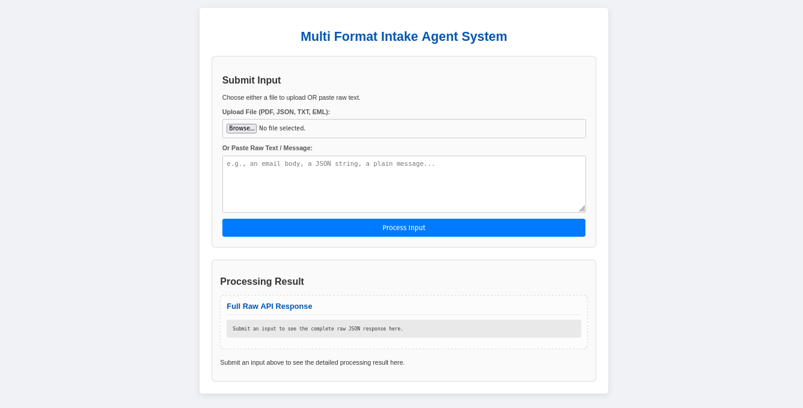

# MultiFormat AI Intake Agent System: My Journey into Intelligent Automation

### "Turning chaos into clarity, one intelligent agent at a time."

-----

## Hello There\!

Building the Flowbit AI Intake Agent System has been more than just a project for me; it's been an intensive deep dive into the fascinating world of AI-driven automation, multi-agent architectures, and robust backend/frontend development. From grappling with diverse data formats to orchestrating intelligent agents and crafting a truly intuitive user experience, this endeavor has been a profound learning curve.

I'm incredibly proud of what I've accomplished here, not just in terms of code, but in understanding how complex systems can be broken down, built up, and brought to life. This project showcases my dedication, problem-solving abilities, and a genuine passion for creating intelligent solutions that streamline real-world challenges.

-----

## 🎯 About This Project

Imagine a constant deluge of incoming data – emails, documents, forms, reports – each with its own format and underlying intent. Manually sifting through this is time-consuming, error-prone, and stifles efficiency.

The **Flowbit AI Intake Agent System** is my answer to this challenge. It's an intelligent pipeline designed to **automatically understand, process, and route diverse incoming data**. Whether it's an email asking for a quote, a JSON file with transaction details, or a PDF invoice, this system acts as a digital brain, classifying inputs, extracting key information, and preparing them for the right business action. It's about bringing structured order to unstructured chaos.

### Features I'm Most Excited About:

  * **Universal Input Handling:** Upload `.eml`, `.json`, `.txt`, `.pdf` files, or simply paste raw text. The system embraces diversity from the get-go.
  * **Intelligent AI Classification:** At its core, a `ClassifierAgent` acts like a discerning gatekeeper, using AI to figure out *what* the input is (its format) and *why* it's here (its intent). This isn't just pattern matching; it's about understanding context.
  * **Specialized Data Extraction:** Once classified, the input is handed off to specialized agents (e.g., `EmailAgent`, `JSONAgent`, `PDFAgent`). These are the domain experts, meticulously extracting the specific details needed for action.
  * **Smart Action Routing:** The `ActionRouter` is the strategic mind, deciding the definitive next step based on the extracted intelligence – whether it's creating a CRM lead, escalating a complaint, logging a transaction, or recognizing that manual review is needed.
  * **Transparent & Humanized Output:** I firmly believe in clarity. The web interface doesn't just show a raw API response (though that's there too\!). It dynamically breaks down every step of the processing – from initial metadata to classification, specialized extraction, and final action outcome – into clean, digestible, color-coded blocks. No more guessing what happened behind the scenes\!
  * **Graceful "Unknown" Handling:** Not every input fits neatly into a box. For "unclassified" or generic inputs, the system doesn't break; it intelligently flags them as "Other" and provides "Unclassified Input Details," explicitly indicating a need for human attention. This was a critical design choice for robustness.
  * **Dockerized for Simplicity:** Thanks to Docker Compose, getting this entire multi-component system up and running on *any* machine is a breeze. Consistent environments, zero dependency headaches – just `docker compose up`.

-----

## The Brains Behind the Operation: How It's Built

This system embodies principles of modularity, scalability, and transparent AI workflow. Building it gave me hands-on experience with a modern, agent-based architecture:

1.  **FastAPI Backend (The Responsive Core):** Python's FastAPI forms the lightning-fast, asynchronous backbone. It handles all incoming requests, orchestrates the agent flow, and serves the web UI. Learning to build clean, type-hinted APIs was a significant step here.
2.  **Modular Agents (The Specialized Minds):** Each agent (`ClassifierAgent`, `EmailAgent`, `JSONAgent`, `PDFAgent`, `ActionRouter`) is a self-contained unit responsible for a specific task. This modularity was key – it means we can swap out or add new AI models, data formats, or actions without disrupting the whole system.
3.  **Flow Orchestration (The Conductor):** The system intelligently routes data between these agents. This involved designing a logical flow that adapts based on classification outcomes, ensuring efficiency and accuracy.
4.  **Dynamic Frontend (The User's Window):** The `index.html` (built with HTML, CSS, and JavaScript) isn't just a static page. It dynamically processes the complex JSON API response and transforms it into the structured, color-coded, and intuitive output you see, enhancing user understanding and debuggability. This was a fantastic exercise in client-side data manipulation and UI/UX thinking.
5.  **Containerization with Docker Compose (The Deployment Magic):** Packaging the entire application, including its dependencies, into Docker containers ensures a consistent development and deployment environment. This experience was invaluable for understanding reproducible builds and simplifying setup.

-----

## My Learning & Growth Journey Here

This project pushed me to learn and apply a wide array of skills, going far beyond simple coding. Here’s a glimpse of what I gained:

  * **Mastered FastAPI:** From routing to request/response models, middleware, and serving static files.
  * **Deep Dive into Agent-Based Architectures:** Understanding the power of breaking down complex problems into specialized, interacting "agents."
  * **Containerization Proficiency:** Gained hands-on experience with `Dockerfile` and `docker-compose.yml` for seamless environment management.
  * **Advanced Frontend Interaction:** Learned to parse complex JSON responses dynamically in JavaScript, create HTML elements on the fly, and apply CSS for meaningful data visualization.
  * **System Design & Orchestration:** Developed an understanding of how to design a fluid data flow between disparate components.
  * **Robust Error & Edge Case Handling:** Specifically designing for scenarios like "unclassified inputs" rather than crashing, demonstrating foresight in real-world applications.
  * **Prompt Engineering (Conceptual):** While agents are mocked, the structure is ready for advanced prompt generation techniques to guide LLMs effectively.
  * **Testing Mindset:** Though the tests are unit-level, the process reinforced the importance of isolating and verifying component behavior.

This project is a testament to my ability to quickly grasp new technologies, apply complex architectural patterns, and build a user-centric solution from the ground up.

-----

## 🛠️ The Toolkit I Used

  * **Backend:** Python 3.13, FastAPI
  * **Containerization:** Docker, Docker Compose
  * **Frontend:** HTML, CSS, JavaScript
  * **Dependencies:** Managed via `requirements.txt`
  * **Testing:** Pytest

-----

## 🚀 Getting Started

1.  **Clone the Repository:**

    ```bash
    git clone https://github.com/rprakashdass/flowbit-ai-intake-agent.git
    cd flowbit-ai-intake-agent
    ```

2.  **Launch with Docker Compose:**

    ```bash
    docker compose build
    docker compose up -d
    ```

    *(This will build the necessary Docker image and start the FastAPI application in the background.)*

3.  **Verify Running:**

    ```bash
    docker ps
    ```

    *(Confirm your `flowbit-ai-intake-agent` container is active.)*

-----

## 💻 Usage & See It in Action\!

Open your browser and navigate to:

```
http://localhost:8000/
```

You'll be greeted by the intuitive web UI.



  * **Upload:** Choose a sample `.eml`, `.json`, `.txt`, or `.pdf` file.
  * **Paste:** Or paste any raw text, email body, or JSON string.
  * **Process:** Click "Process Input."

**Witness the magic\!** The "Processing Result" section will dynamically populate, showing:

  * An `Overall Status` indicating the high-level outcome.
  * The `Full Raw API Response` for complete transparency.
  * A series of neatly organized, color-coded boxes detailing each step:
      * `Input Metadata`
      * `Classifier Agent`'s verdict
      * `Email Agent`, `JSON Agent`, `PDF Agent` (if applicable) or `Unclassified Input Details`
      * The final `Action Router Outcome`

-----

## 🧪 Detailed Test Scenarios & Expected Outputs

Here are some specific scenarios to demonstrate the system's capabilities. Use these to generate your screenshots for the "Example Outputs & Demonstration" section below.

### Scenario 1: Email RFQ Processing (Success Path)

  * **Input Type:** Raw Text (Paste) or `.eml` file
  * **Sample Input Data:**
    ```
    Subject: RFQ - New Software Licenses - Urgent Request
    From: procurement@example.com
    To: sales@flowbit.ai
    Date: Wed, 05 Jun 2025 10:00:00 -0400

    Dear Flowbit Sales Team,

    We are evaluating new AI-powered analytics software for our enterprise. We require a quote for 100 annual licenses of your "FlowAnalytics Pro" solution, including premium support for 3 years.

    Please provide a detailed proposal, including pricing tiers, implementation timelines, and any available volume discounts. Our deadline for vendor selection is end of next month.

    We look forward to your prompt response.

    Best regards,

    Sarah Chen
    Procurement Manager
    GlobalTech Innovations
    sarah.chen@example.com
    ```
  * **Expected Workflow:**
    1.  `ClassifierAgent`: Identifies `format: "Email"`, `intent: "RFQ"`.
    2.  `EmailAgent`: Extracts sender details, subject, and a summary.
    3.  `ActionRouter`: Determines `potential_action_type: "Escalate to CRM"` (or similar, depending on your `main.py` mock).
  * **Expected UI Output (Key Sections):**
      * **Overall Status:** `Success` (or `Pending Review` if the mock leads to that).
      * **Classifier Agent Box:** `Format: Email`, `Intent: RFQ`.
      * **Email Agent Box:** Shows extracted `sender_name`, `sender_email`, `subject`, `issue_summary`, etc.
      * **Action Router Outcome Box:** `Action Triggered: CRM Escalation` (or `Manual Review Task`), `Status: success`.

### Scenario 2: JSON Invoice Processing (Success Path)

  * **Input Type:** `.json` file or Raw Text (Paste)
  * **Sample Input Data:**
    ```json
    {
      "webhook_event": "invoice_received",
      "data": {
        "invoiceId": "INV-FLB-2025-06-001",
        "customerReference": "CUST-9876",
        "issueDate": "2025-06-01",
        "dueDate": "2025-06-30",
        "vendor": {
          "name": "Supplier Solutions Inc.",
          "email": "invoicing@supplier.com"
        },
        "items": [
          {
            "description": "Cloud Hosting Service - May 2025",
            "quantity": 1,
            "unitPrice": 500.00,
            "total": 500.00
          },
          {
            "description": "Managed Services - May 2025",
            "quantity": 1,
            "unitPrice": 750.00,
            "total": 750.00
          }
        ],
        "grandTotal": 1250.00,
        "currency": "USD",
        "paymentStatus": "pending"
      }
    }
    ```
  * **Expected Workflow:**
    1.  `ClassifierAgent`: Identifies `format: "JSON"`, `intent: "Invoice"`.
    2.  `JSONAgent`: Extracts `document_id`, `document_type`, `total_amount`, `line_items`, etc.
    3.  `ActionRouter`: Determines `potential_action_type: "Log Transaction"` (or `Review High Value Invoice` if total is high).
  * **Expected UI Output (Key Sections):**
      * **Overall Status:** `Success` (or `Pending Review` if applicable).
      * **Classifier Agent Box:** `Format: JSON`, `Intent: Invoice`.
      * **JSON Agent Box:** Shows extracted fields like `document_id`, `total_amount`, `currency`, `line_items`.
      * **Action Router Outcome Box:** `Action Triggered: Log Transaction` (or `High Value Invoice Review`), `Status: success`.

### Scenario 3: PDF Regulatory Policy (Success Path)

  * **Input Type:** `.pdf` file (ensure you've created `agents/pdf_agent_sample_data/sample_regulatory_policy.pdf` from the text below)
  * **Sample Input Data (Convert to PDF):**
    ```
    Flowbit AI - Data Governance Policy v3.0
    Effective Date: March 1, 2025

    This document outlines Flowbit AI's commitment to data privacy and security. Our practices are fully aligned with the General Data Protection Regulation (GDPR) requirements for processing personal data, and we maintain strict adherence to HIPAA standards for protected health information (PHI). All data handling procedures are audited annually to ensure PCI DSS compliance.

    For inquiries, contact compliance@flowbit.ai.
    ```
  * **Expected Workflow:**
    1.  `ClassifierAgent`: Identifies `format: "PDF"`, `intent: "Regulation"`.
    2.  `PDFAgent`: Extracts `document_type`, `title`, `summary`, and importantly, `regulatory_compliance_flags` (`contains_gdpr_keywords`, `contains_hipaa_keywords`, `keywords_found`).
    3.  `ActionRouter`: Determines `potential_action_type: "Flag Compliance Document"`.
  * **Expected UI Output (Key Sections):**
      * **Overall Status:** `Success` (or `Pending Review`).
      * **Classifier Agent Box:** `Format: PDF`, `Intent: Regulation`.
      * **PDF Agent Box:** Shows extracted `document_type`, `title`, `summary`, and `regulatory_compliance_flags` with boolean values and found keywords.
      * **Action Router Outcome Box:** `Action Triggered: Compliance Document Flag`, `Status: success`.

### Scenario 4: Unclassified / Generic Text Input (Edge Case Handling)

  * **Input Type:** Raw Text (Paste)
  * **Sample Input Data:**
    ```
    Just some random text for testing purposes. It doesn't look like an email or a JSON or a PDF.
    ```
    *(Or even just "f")*
  * **Expected Workflow:**
    1.  `ClassifierAgent`: Identifies `format: "Other"`, `intent: "Other"`.
    2.  No specialized agent (Email, JSON, PDF) is invoked.
    3.  `ActionRouter`: Determines `potential_action_type: "Input Classification Required"`.
  * **Expected UI Output (Key Sections):**
      * **Overall Status:** `Pending Classification`.
      * **Classifier Agent Box:** `Format: Other`, `Intent: Other`.
      * **Unclassified Input Details Box:** Shows `status: "No_Specific_Agent_Applicable"`, `message: "The input could not be classified..."`.
      * **Action Router Outcome Box:** `Action Triggered: Input Classification Required`, `Status: pending_classification`.

-----

## 📸 Example Outputs & Demonstration

Here are some visual demonstrations of the system's robust processing and detailed output:

#### 1\. Successful Email (RFQ) Processing & Action Routing
<details>
  <summary>Click to view full screenshot: Email RFQ Processing</summary>
  
  
  
  
</details>

*(Brief description: This screenshot demonstrates an email being correctly classified, key details extracted by the `EmailAgent`, and a relevant action being proposed by the `ActionRouter`, such as CRM Lead Creation or Manual Review.)*

#### 2\. JSON Invoice Processing & Transaction Logging

*(Brief description: An example of parsing a JSON invoice. The `JSONAgent` extracts precise transaction details, and the `ActionRouter` suggests a "Log Transaction" action, highlighting the automated data flow.)*

#### 3\. PDF Regulatory Policy Analysis

<details>
  <summary>Click to view full screenshot: Email RFQ Processing</summary>


</details>

*(Brief description: This image illustrates the `PDFAgent` extracting content from a regulatory document, identifying compliance keywords (like GDPR, HIPAA), and the `ActionRouter` correctly flagging it for a "Compliance Review".)*

#### 4\. Handling Unclassified / Generic Inputs Gracefully

<details>
  <summary>Click to view full screenshot: Email RFQ Processing</summary>


</details>

*(Brief description: Witness how the system intelligently identifies inputs that don't fit specific categories. It flags them as "Other" and provides clear "Unclassified Input Details," explicitly indicating a need for human attention, showcasing robust error handling.)*

-----


## 🧠 References & Inspirations: My Learning Path

This project was built upon insights from various architectural patterns and AI concepts. Here are some of the resources that significantly influenced my learning and design choices:

* **Message Channels & Event-Driven Architecture:** (Relevant to how agents might communicate or data flows)
    * [Unlock the Power of Event-Driven Architecture: How Netflix & Uber Handle Billions of Events Daily](https://www.youtube.com/watch?v=hrvx8Nv9eQA)  
      *(Understand the principles and real-world applications of event-driven systems.)*
* **AI Agents & Multi-Agent Systems:** (Foundational to the core design)
    * [Build a Multi-Agent System with CrewAI | Agentic AI Tutorial](https://www.youtube.com/watch?v=qsrl2DHYi1Y)  
      *(Learn how to create and orchestrate collaborative AI agents.)*
* **Workflow Orchestration:** (Crucial for the `FlowCoordinator` and `ActionRouter` logic)
    * [Orchestration or Choreography?](https://www.youtube.com/watch?v=RQMRXAGxLiw)  
      *(Explore when to use orchestration vs. choreography in complex systems.)*
* **AI for Test Case & Prompt Generation:** (Highlights thinking beyond just the core logic)
    * [AI Test Case Generator: Transform Jira User Stories into Automated Test Cases](https://www.youtube.com/watch?v=YX26b0MB4lA) *(Focus on how AI can assist in generating test data or scenarios.)*

-----

## 🌟 Why This Project Matters (And Why I'm a Great Fit\!)

This Flowbit AI Intake Agent System isn't just a collection of technologies; it's a testament to my ability to:

  * **Translate complex problems into elegant, modular solutions.**
  * **Build robust, scalable backend systems** using modern frameworks like FastAPI.
  * **Craft intuitive and informative user interfaces** that enhance understanding.
  * **Integrate and orchestrate diverse components** into a cohesive system.
  * **Adapt and learn new technologies rapidly** (like Docker, advanced JS DOM manipulation, and agent patterns).
  * **Think critically about edge cases and user experience,** ensuring the system is not only functional but also user-friendly and reliable.

I'm incredibly passionate about building intelligent systems that solve real-world problems, and this project truly reflects that drive. I'm eager to bring this same dedication, curiosity, and skill set to your team and contribute meaningfully to your projects.

-----

## 🤝 Let's Connect\!

I'd love to discuss this project further or any opportunities you might have.
  * **Website:** [https://www.rprakashdass.in/]
  * **GitHub:** [https://github.com/rprakashdass]
  * **LinkedIn:** [https://linkedin.com/in/rprakashdass]
  * **Email:** [rprakashdass@gmail.com]

-----

## 📜 License

This project is open-source and available under the [MIT License](https://www.google.com/search?q=LICENSE).

-----
