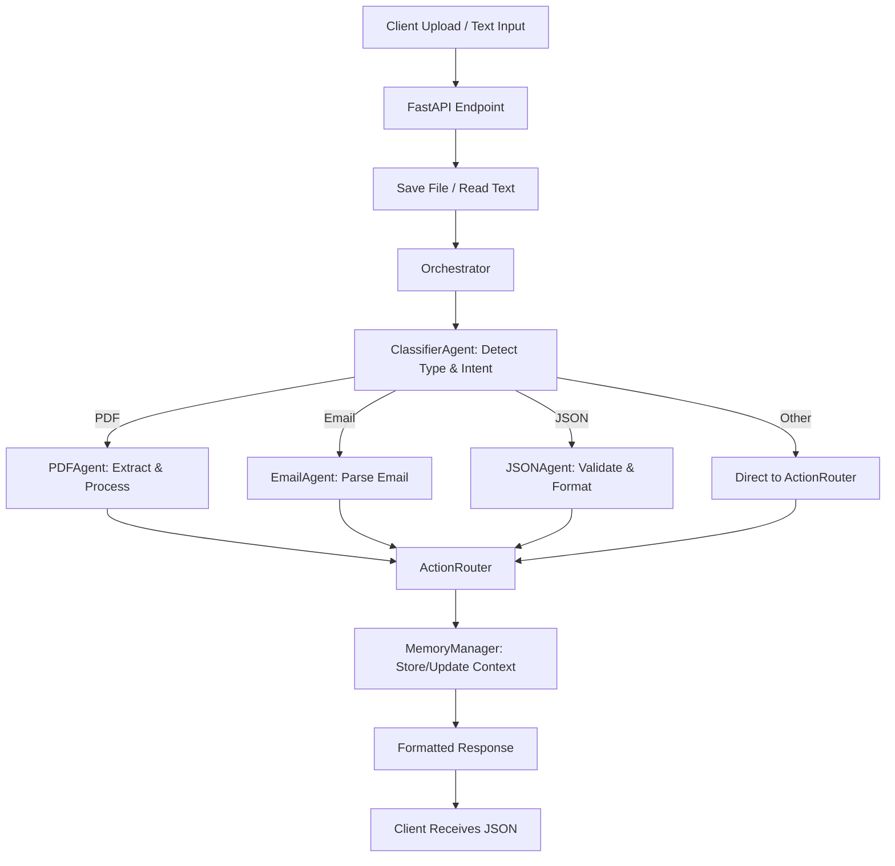

# **Architecture and Flow Documentation**

## **1. Architecture Overview**

### **Core Components**

* **FastAPI Application**

  * Serves as the entry point for all API requests.
  * Manages routes for processing files, raw text, and serving the frontend UI.

* **Orchestrator**

  * Central brain that connects all agents.
  * Handles classification, routing, memory management, and action execution.

* **Agents**

  * **ClassifierAgent** – Detects content type and intent.
  * **EmailAgent** – Parses and processes email content.
  * **JSONAgent** – Validates and reformats JSON.
  * **PDFAgent** – Extracts and processes text from PDFs.
  * **ActionRouter** – Executes actions based on agent outputs.

* **MemoryManager**

  * Stores and retrieves conversation context and metadata.
  * Enables multi-step workflows with history awareness.

* **Static File Server**

  * Serves frontend assets (HTML, JS, CSS) to the browser.

---

## **2. Design Principles**

* **Modular** – Each agent is independent, focused on a single responsibility.
* **Configurable** – Upload directory, Redis host/port, and API keys are environment-driven (via `BaseSettings`).
* **Extensible** – New file types, agents, and actions can be added without breaking existing flow.
* **Scalable** – Supports concurrent processing via FastAPI’s async capabilities.

---

## **3. Data Flow**

1. **Client Uploads or Sends Input**

   * Either uploads a file (`.pdf`, `.json`, `.txt`, `.eml`) or provides raw text.

2. **FastAPI Receives Request**

   * Saves file temporarily or reads text directly.

3. **Orchestrator Called**

   * Assigns a **unique conversation ID**.
   * Stores raw input in `MemoryManager`.
   * Runs `ClassifierAgent` to detect content type.

4. **Routing to the Right Agent**

   * **PDF** → `PDFAgent` → Extract text → Format output.
   * **Email** → `EmailAgent` → Extract sender, subject, body.
   * **JSON** → `JSONAgent` → Validate schema, reformat.
   * **Other text** → Pass directly to ActionRouter.

5. **Action Routing**

   * If the agent result suggests an action (e.g., database update, email reply), `ActionRouter` handles it.

6. **Response Sent**

   * Returns a **formatted JSON response** containing processed data and any detected anomalies or missing fields.

---

## **4. Extending the System**

### Adding a New Agent

1. Create a class that implements the `process()` method.
2. Register it inside the Orchestrator’s routing logic.

Example:

```python
class CSVAgent:
    def process(self, content):
        # Parse CSV, validate columns
        return {"status": "success", "rows": 120}
```

---

## **5. API Reference**

### **Endpoints**

* `POST /process_input`

  * **Form Data**:

    * `input_text` *(optional)*
    * `file` *(optional)* – Supported formats: `.pdf`, `.json`, `.txt`, `.eml`
  * **Response**:

    * Processed data, metadata, anomalies.

* `GET /`

  * Redirects to frontend UI.

* `GET /static/*`

  * Serves frontend assets.

---

## **6. Flow Diagram**



---

## **7. Tech Stack**

* **Backend**: FastAPI (Python)
* **AI/Processing**: Custom Agents + LLM Integration
* **Storage**: Redis (context), Local Uploads
* **Frontend**: Static HTML/CSS/JS served via FastAPI
* **Config Management**: `pydantic.BaseSettings`
